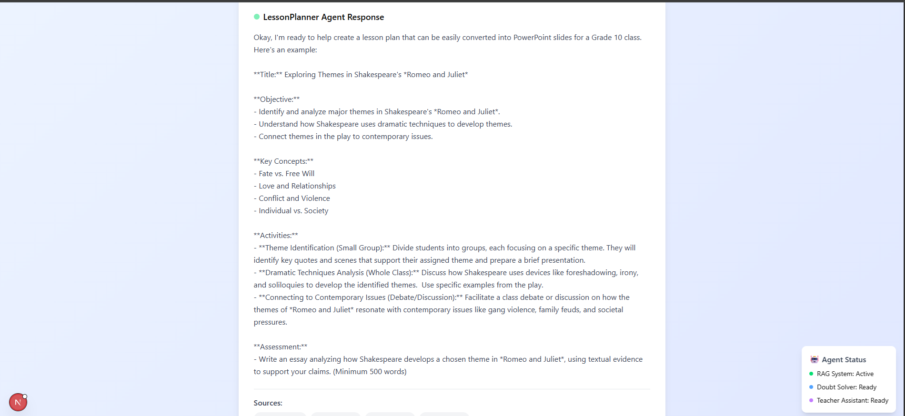
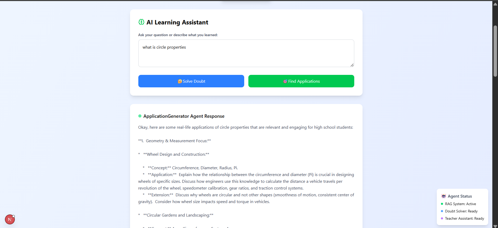
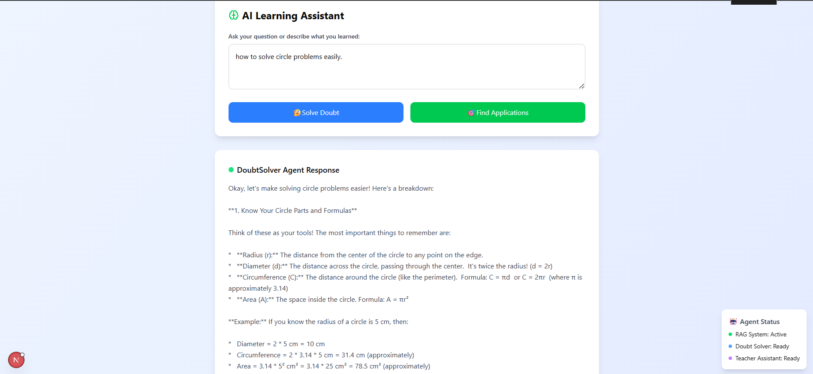

# 📘 ShikshaSetu – EduAgent: AI-Powered Learning Platform

**ShikshaSetu** is a multi-agent AI learning platform that empowers students and teachers through Retrieval-Augmented Generation (RAG). It enables seamless content upload, doubt-solving, application discovery, and automatic lesson planning — all powered by custom agents designed for personalized education.

---

## 🚀 Features

- 🔍 **Content Upload:** Upload educational PDFs (textbooks, notes) and vectorize them for retrieval.
- 💬 **Student Doubt Solver:** Ask natural language questions and get context-aware answers.
- 🎯 **Application Finder:** Explore real-life applications of concepts.
- 📚 **Teacher Assistant:** Generate lesson plans based on topics.
- 🧠 **Multi-Agent RAG System:** Intelligent agents for different educational tasks.
- 🖼️ **Interactive UI:** Clean, responsive frontend built with Next.js and Tailwind CSS.

---

## 🧱 Tech Stack

| Layer         | Technologies Used                                                                 |
|---------------|------------------------------------------------------------------------------------|
| Frontend      | `Next.js`, `React`, `Tailwind CSS`, `Lucide Icons`                                |
| Backend       | `Next.js API Routes`, `LangChain`, `OpenAI API`, `Pinecone`                       |
| RAG Core      | `LangChain`, `Text Splitters`, `Embeddings`, `Vector Store`, `Agents`             |
| File Handling | `FormData`, `PDF parsing`, `@pdf-parse`                                           |
| Hosting       | `Vercel` (Frontend & API), `Pinecone` (Vector DB), `OpenAI` (LLM Inference)       |

---

## 📁 Folder Structure

```bash
shikshasetu/
├── app/                    # Next.js App directory
│   └── api/
│       ├── upload/         # Upload API route (PDF ingestion)
│       └── query/          # Query API route (agent responses)
├── components/             # Shared components (e.g., UI Cards)
├── lib/                    # Core logic
│   └── rag/                # RAG pipeline logic (ingest + query)
├── public/                 # Static assets
├── styles/                 # Global styles
└── README.md
```bash
---

## 📸 Screenshots

### 🖼️ Homepage – Job Listings
![Homepage]
(./screenshots/homepage.png) 
(./screenshots/homepage2.png)
### 🧾 RAG Agents 




---

## 💡 Use Cases

- 📖 **Students** can ask follow-up questions directly from their syllabus and receive intelligent answers with references.
- 👩‍🏫 **Teachers** can generate structured lesson plans based on any topic in seconds.
- 🧪 **Institutions** can integrate EduAgent with LMS platforms for curriculum enhancement.

---

##  🙌 Contributors
Himaja Pannati – Full-stack Developer, AI/ML Enthusiast
B.E. Computer Engineering, VESIT

Anjali Thakrani – Frontend Developer, ML Developer
B.E. Computer Engineering, VESIT
